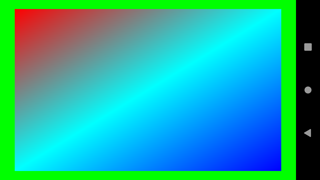
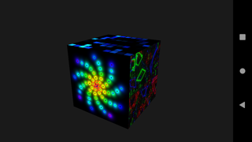

# gl2es
GL2ES is a lightweight OpenGL 2.1/1.5 to GLES 2.0+ translation library, with support for Oculus VR.  
Is a part of [Otus Lisp (Ol)](https://github.com/yuriy-chumak/ol) and is developed primarily for use with it, but can be used independently.

Allows to run the same Ol OpenGL code on desktop and android without any changes.

## Early stage. In active development!

Your issues, tickets, PRs, and wishes are highly welcome.

## Building

Build scripts [rules.mk](https://github.com/yuriy-chumak/ol/blob/master/extensions/android/rules.mk) and [Android.mk](https://github.com/yuriy-chumak/ol/blob/master/extensions/android/jni/Android.mk) are part of the Otus Lisp repository. Moreover, some other useful libraries (like [GLU](https://github.com/yuriy-chumak/GLU)) are also developed as a part of Ol.

So the easiest way is to clone Otus Lisp repo and work inside.

You need to:
1. Android NDK. Put NDK path into `NDK_ROOT` env. variable
1. Clone the Otus Lisp repository somewhere (let's say to the `$OL` folder)
   * don't forget the `--recursive` flag, OpenGL libraries is a submodule
1. Go to `$OL/extensions/android/jni`
1. Run [`./configure`](https://github.com/yuriy-chumak/ol/blob/master/extensions/android/jni/configure) script once
1. Go back to `$OL` folder and run `make android`

These steps will produce android *.so libraries in the `$OL/extensions/android/libs/` folder.

### In your own way
If you want to build gl2es in your own way, you need to:
1. Convert `shaders/*.glsl` files to C byte array form into `src/*.b` files (find my receipe in this [Makefile](https://github.com/yuriy-chumak/gl2es/blob/6aa2017a0cbd0f6e2a1cb0d58b4b8073cc8b2b20/Makefile#L27).
2. Add all `src/*.c` files to your build script as sources and `include` folder as include folder. My build receipe with flags and thirdparty libs used can be found in this [Android.mk](https://github.com/yuriy-chumak/ol/blob/a75224f951b97a97a9aaf059ad302ee4a79323ae/extensions/android/jni/Android.mk#L123).

## Tests / Examples

Several tests and examples are available in the `test` folder. All these tests are made assuming that the gl2es repository is part of the entire otus lisp project.  
This makes possible to minimize copy-pasting service code and focus on test logic.

The number of tests will grow in parallel with the library development.

Go to selected test folder and type `make build install check` for tests and `make build install start` for examples. If you have issues with `install` try to `reinstall`. Type `make` to display help.

All tests can be run on the desktop (and should provide same result). Go to `assets` folder and run `./main.lisp` (requires Otus Lisp with OpenGL libraries to be installed; if you don't have one go to `$OL` folder and type `make; sudo make install`).

Below are shown few examples. More tests/examples info can be found in the [`tests`](tests) folder.

### 'color' example
Simple OpenGL 1.0 color quad drawing using glBegin/glEnd.

### 'programs' example
OpenGL 2.1 example with shaders, textures, and framebuffers.

