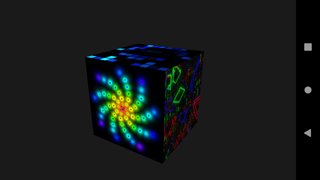

Requirements
============

* Bash Shell (because of `<(command)`)
* Gnu Make
* Android SDK
* Android NDK

Tests / Examples
================

color
-----

Simple OpenGL 1.0 color quad drawing with glBegin/glEnd.  

matrices
--------

OpenGL 1.1 and GLU usage.  
glMatrixMode / gluPerspective / gluLookAt / glTranslatef / glRotatef demo.  

programs
--------

OpenGL 2.1 example with shaders, textures and framebuffers.  
